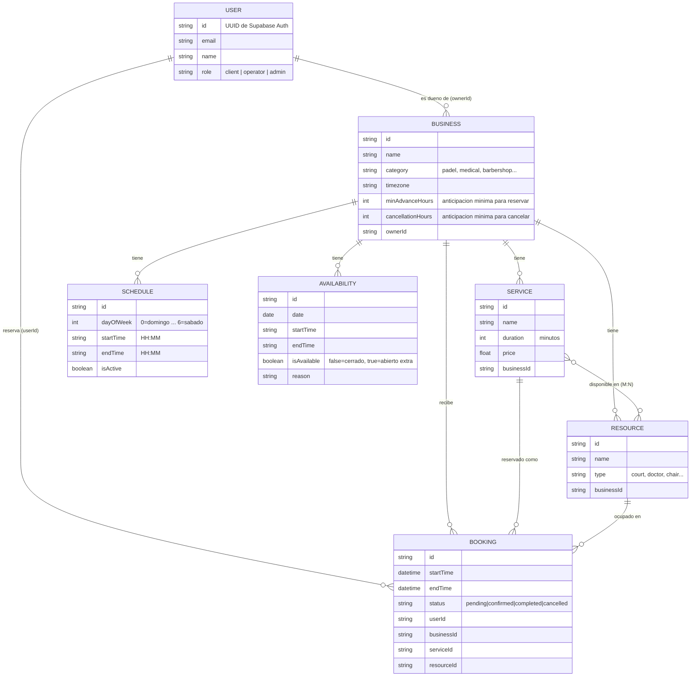
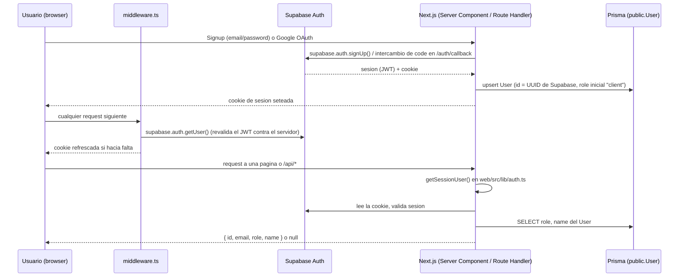
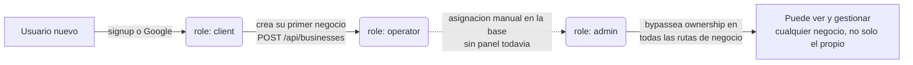
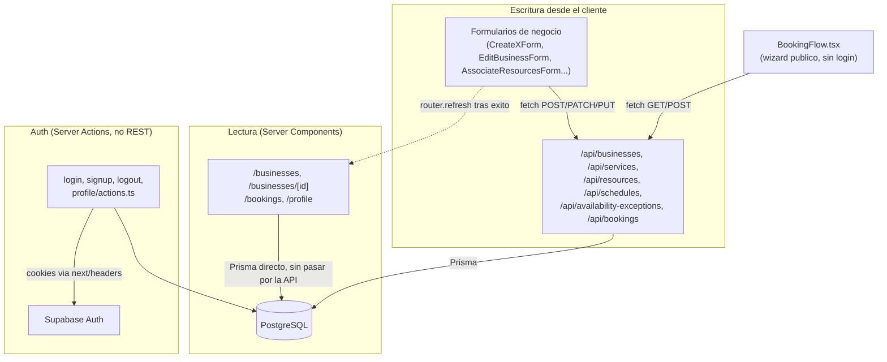
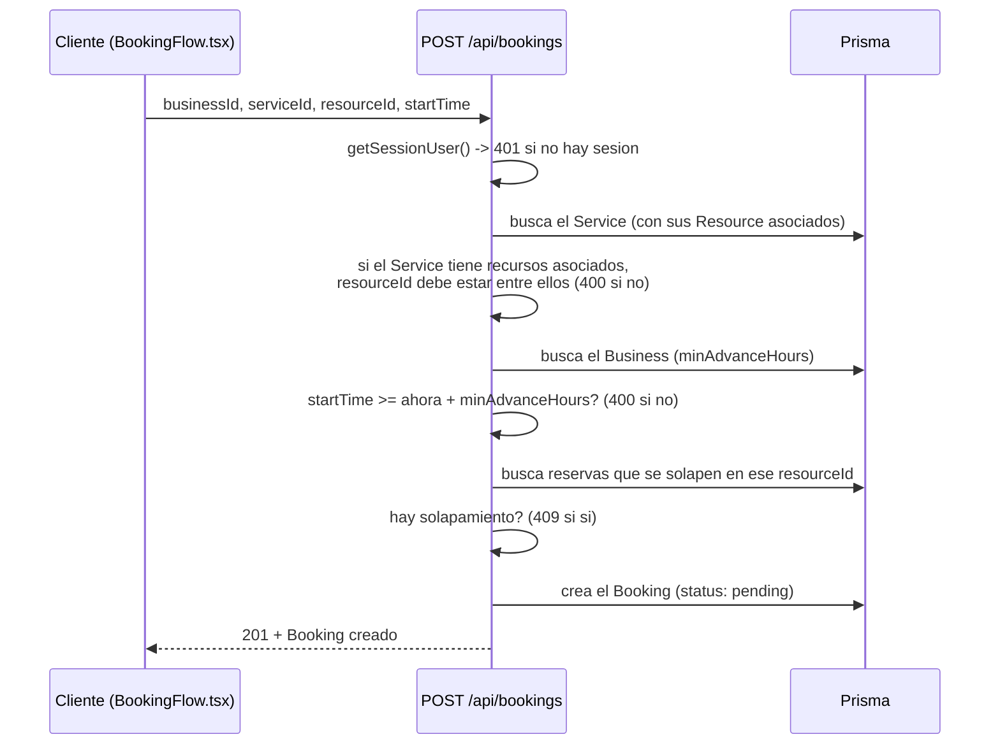

# Arquitectura — Turnos

Mapa conceptual de lo construido hasta ahora. Los diagramas usan [Mermaid](https://mermaid.js.org/), que GitHub y VS Code (preview de Markdown integrada) renderizan nativamente sin plugins. Se usa solo sintaxis estable desde hace tiempo (`erDiagram`, `flowchart`, `sequenceDiagram`, cardinalidad `}o--o{`, comentarios `%%`) para evitar que algo se vea bien en uno y no en el otro.

## Stack

- **Web**: Next.js 14 (App Router) + TypeScript, sin librería de UI (estilos con Tailwind CSS).
- **API**: Route Handlers de Next.js bajo `web/src/app/api/*` — pensada para compartirse con la futura app mobile (Expo).
- **Base de datos**: PostgreSQL en Supabase, accedida con Prisma.
- **Auth**: Supabase Auth (email/password + Google OAuth).
- **Mobile**: Expo + React Native — placeholder, todavía sin desarrollar.

## 1. Modelo de datos

Notas:
- `Service` ↔ `Resource` es many-to-many implícita en Prisma (sin modelo de join propio): `service.resources` / `resource.services`. Si un `Service` no tiene ningún `Resource` asociado todavía, se trata como "sin restricción" (compatible con negocios que nunca configuraron la asociación).
- `Schedule` tiene un índice único por `(businessId, dayOfWeek, startTime, endTime)` — permite varios bloques el mismo día (turnos partidos, ej. 9-12 y 14-18).
- `Availability` son excepciones puntuales por fecha exacta (feriados, horario especial), distintas del horario semanal recurrente de `Schedule`.

## 2. Autenticación

`getSessionUser()` es el único punto de verdad: lo usan todos los Route Handlers y Server Components para saber quién está logueado y qué rol tiene. `getUser()` (no `getSession()`) se usa a propósito en el middleware porque revalida contra el servidor de Supabase en cada request.

## 3. Roles

`operator` es descriptivo, no una puerta de entrada: cualquier usuario puede crear negocios libremente, el rol simplemente refleja que ya tiene al menos uno. `admin` es el único rol con un permiso especial real hoy.

## 4. Cómo se leen y escriben los datos

Por qué la mezcla: las páginas de gestión (negocios, reservas, perfil) leen directo con Prisma porque son Server Components — más simple y rápido que un round-trip a la propia API. Las mutaciones de "datos de negocio" (crear servicio, asociar recurso, etc.) pasan por la API REST a propósito, pensada para que la futura app mobile pueda reusarla. Auth usa Server Actions porque está atada 1 a 1 a cookies de Next, algo que mobile resolvería distinto (con el SDK de Supabase directo).

## 5. Flujo de reserva

Pendiente conocido: `BookingFlow.tsx` todavía no consulta `/api/availability` para mostrar horarios reales — el paso de elegir fecha/hora es un campo libre. El cálculo de disponibilidad (turnos partidos, excepciones) está implementado y validado en el backend, pero no conectado a esta pantalla todavía.

## 6. Rutas API (referencia rápida)

| Ruta | Métodos | Notas |
|---|---|---|
| `/api/businesses` | GET (público), POST (sesión) | `ownerId` siempre de la sesión |
| `/api/businesses/[id]` | PATCH (dueño o admin) | distingue "no enviado" de "enviado vacío" |
| `/api/services` | GET (público), POST (dueño o admin) | |
| `/api/services/[id]/resources` | PUT (dueño o admin) | asocia recursos, valida mismo negocio |
| `/api/resources` | GET (público, filtra por `serviceId`), POST (dueño o admin) | |
| `/api/schedules` | GET (público), POST (dueño o admin) | `upsert`, soporta turnos partidos |
| `/api/availability-exceptions` | GET (público), POST (dueño o admin) | feriados / horario especial |
| `/api/availability` | GET (público) | calcula slots reales, combina `Schedule` + excepciones |
| `/api/bookings` | GET (sesión, solo propias), POST (sesión) | valida asociación, anticipación, solapamiento |
| `/api/bookings/[id]` | PATCH (propio, dueño del negocio, o admin) | solo cancelar por ahora |
